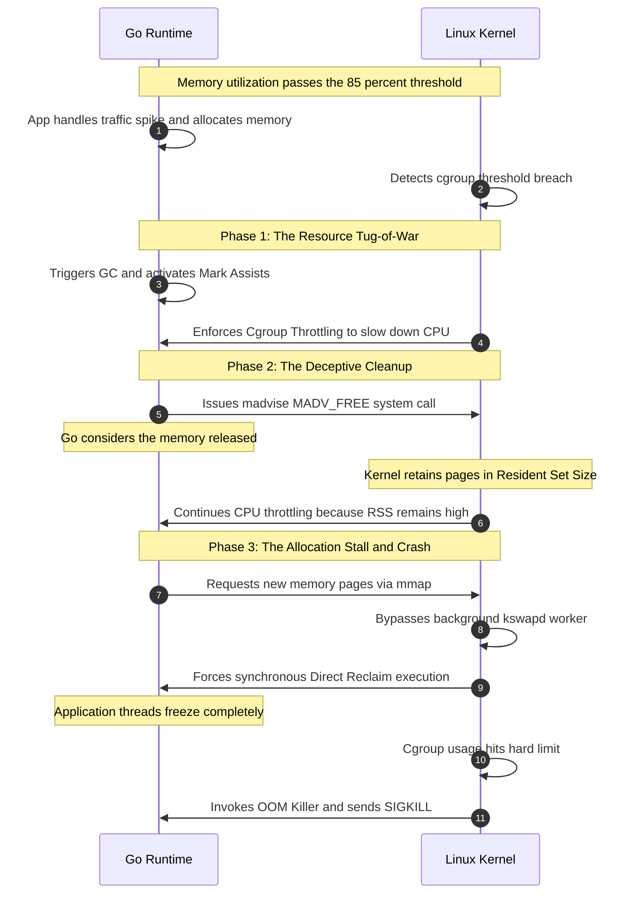

Linux cgroups Memory Performance Analysis in cojunction with GoLang Garabage Collection events

Overview

Memory performance often degrades significantly when a cgroup exceeds roughly **85% memory utilization**. This drop is not a hard physical failure, but rather a consequence of the Linux kernel executing defensive strategies to keep the system stable under high memory pressure. So if the typical GOLang Vault processes are iside 

---

Technical Causes of Performance Degradation

1\. High-Water Mark Throttling

* **Control Loops:** In [cgroups v2 Control Group Hierarchy](https://docs.kernel.org/admin-guide/cgroup-v2.html), when utilization crosses the memory.high threshold, the kernel triggers synchronous reclaim.  
* **Process Penalization:** The kernel deliberately introduces delays (throttling) into the specific processes inside that cgroup to slow down their memory allocation rate. \[[1](https://docs.kernel.org/admin-guide/cgroup-v2.html), [2](https://facebookmicrosites.github.io/cgroup2/docs/memory-controller.html)\]

2\. Eviction Thrashing

* **Cache Eviction:** The kernel begins aggressively dropping page caches (file-backed memory). \[[1](https://utcc.utoronto.ca/~cks/space/blog/linux/CgroupV2MemoryLimitsAndThrashing)\]  
* **Disk Bottlenecks:** If the application immediately needs those dropped pages again, it must fetch them from disk. This results in severe I/O bottlenecks known as **thrashing**. \[[1](https://utcc.utoronto.ca/~cks/space/blog/linux/CgroupV2MemoryLimitsAndThrashing)\]  
* **Anonymous Memory Swap:** If swap is enabled, anonymous memory pages are compressed or moved to disk, creating severe latency spikes when accessed. \[[1](https://utcc.utoronto.ca/~cks/space/blog/linux/CgroupV2MemoryLimitsAndThrashing)\]

3\. Allocation Delays (Direct Reclaim)

* **Asynchronous vs. Synchronous:** Normally, a background kernel thread (kswapd) frees memory asynchronously.  
* **Blocking Operations:** When usage spikes too high, the kernel forces the allocating process into **direct reclaim**. The process halts its actual work and spends CPU cycles clearing space for its own allocation. \[[1](https://serverfault.com/questions/1166165/how-do-memory-limits-in-kubernetes-work-with-cgroup-v2-memory-high)\]

---

Prevention and Optimization Strategies

1\. Tune Swap Settings

* **Lower Swappiness:** Set vm.swappiness to a lower value (e.g., 10 or 20) to discourage the kernel from swapping out active anonymous memory prematurely.  
* **Isolate Swap:** Ensure your cgroup swap limits (memory.swap.max) match your performance requirements so noisy neighbors do not deplete global swap space. \[[1](https://facebookmicrosites.github.io/cgroup2/docs/memory-controller.html)\]

2\. Leverage Memory Quality of Service (QoS)

* **memory.min:** Sets a hard floor. Memory below this usage mark is never reclaimed by the system under any circumstances.  
* **memory.low:** Sets a soft protection boundary. The kernel will only reclaim memory from this cgroup if no other unprotected alternatives exist. \[[1](https://facebookmicrosites.github.io/cgroup2/docs/memory-controller.html)\]

3\. Proactive Monitoring via PSI

* **Pressure Stall Information:** Do not rely solely on percentage metrics. Monitor cgroup-specific PSI files as detailed in the [Linux Kernel PSI Documentation](https://docs.kernel.org/accounting/psi.html). \[[1](https://docs.kernel.org/accounting/psi.html), [2](https://developers.redhat.com/articles/2026/03/18/prepare-enable-linux-pressure-stall-information-red-hat-openshift)\]  
* **Quantifiable Impact:** Look at the some and full metrics to see exactly what percentage of CPU time is wasted waiting for memory allocations or page resolves. You can view real-world troubleshooting workflows via the [Netdata Cgroups Memory Guide](https://www.netdata.cloud/academy/diagnosing-linux-cgroups/). \[[1](https://kubernetes.io/docs/reference/instrumentation/understand-psi-metrics/), [2](https://www.netdata.cloud/academy/diagnosing-linux-cgroups/)\]

---
What Happens When Go GC Hits (The Breakdown)

1\. CPU Spikes due to "Mark Assists"

The Go GC runs concurrently alongside your application workers. However, if your application allocates new memory faster than the background GC can clean it up, Go’s **Pacing Algorithm** steps in. \[[1](https://blog.allegro.tech/2025/08/how-garbage-collector-works-in-go-and-how-it-affects-your-programs.html), [2](https://goperf.dev/01-common-patterns/gc/), [3](https://lorbic.com/dont-take-out-the-garbage-go-gc-deep-dive/)\]

* **The "Tax" System:** The runtime forces the specific goroutine making the allocation to pause its application logic and **assist with GC marking work**. \[[1](https://lorbic.com/dont-take-out-the-garbage-go-gc-deep-dive/)\]  
* **Performance Impact:** Sudden, unpredictable tail-latency spikes (p99) across API endpoints as execution threads are hijacked to clean up memory. \[[1](https://medium.com/@jedwaltondev/deep-dive-into-gos-garbage-collector-tuning-memory-reducing-gc-pauses-e00c409f1d39), [2](https://lorbic.com/dont-take-out-the-garbage-go-gc-deep-dive/)\]

2\. The Memory "Whack-A-Mole" (Madvise vs. Cgroups)

When Go finishes a sweep phase, it identifies pages it no longer needs. It tells the Linux kernel it is done with them using a system call called madvise (specifically MADV\_DONTNEED or MADV\_FREE). \[[1](https://goperf.dev/01-common-patterns/gc/), [2](https://blog.allegro.tech/2025/08/how-garbage-collector-works-in-go-and-how-it-affects-your-programs.html), [3](https://utcc.utoronto.ca/~cks/space/blog/programming/GoNoMemoryFreeing), [4](https://discuss.ocaml.org/t/ocaml-5-gc-releasing-memory-back-to-the-os/11293), [5](https://0x434b.dev/learning-linux-kernel-exploitation-part-2-cve-2022-0847/)\]

* MADV\_DONTNEED forces the kernel to instantly drop the pages, reducing the cgroup’s active memory footprint immediately.  
* MADV\_FREE tells the kernel: *"You can have these back if you need them, but I will keep using them if you don't."*  
* **The Catch:** Inside a cgroup hitting **85% usage**, MADV\_FREE pages still count toward your RSS (Resident Set Size). The cgroup may breach its memory.high limit and trigger kernel-level throttling **even though Go thinks it just freed the memory**. \[[1](https://github.com/golang/go/issues/75164), [2](https://chessman7.substack.com/p/is-it-possible-to-lock-a-processs), [3](https://www.reddit.com/r/golang/comments/l4lkl1/possible_memory_leak_with_bufio_and_osopen_not/)\]

3\. Allocation Stalls at the OS Level

When the Go runtime runs out of its internal pre-allocated arenas, it has to ask the Linux kernel for new pages via mmap. If your cgroup is at 85% capacity:

* Your application’s request for memory blocks until the Linux kernel completes a **direct reclaim** cycle.  
* Go’s ultra-fast memory allocator is forced to wait on synchronous disk I/O or page-cache thrashing, completely bypassing Go's latency-optimized design. \[[1](https://github.com/golang/go/issues/61718)\]

4\. The OOM Death Spiral (GOMEMLIMIT Panic Mode)

If your cgroup has a hard boundary (memory.max), hitting 85%+ means you are dangerously close to the Linux Out-Of-Memory (OOM) killer. \[[1](https://github.com/golang/go/issues/75164)\]

* Go tries to prevent this using an environment variable called [GOMEMLIMIT](https://go.dev/doc/gc-guide).  
* When Go notices total memory approaching GOMEMLIMIT, it abandons its normal scheduling and **runs the GC continuously** (thrashing the CPU at 100%) to claw back every possible byte. This preserves uptime but completely tanks throughput. \[[1](https://internals-for-interns.com/posts/go-garbage-collector/), [2](https://medium.com/@jedwaltondev/deep-dive-into-gos-garbage-collector-tuning-memory-reducing-gc-pauses-e00c409f1d39), [3](https://medium.com/@sharmatushar759/garbage-collection-in-go-lang-4826c01a9156), [4](https://lorbic.com/dont-take-out-the-garbage-go-gc-deep-dive/)\]

---

Timeline Scenario: The 85% Memory \+ Go GC Collision

And now let’s think what is going to happen when those two events are combined. 

Phase 1: The Resource Tug-of-War

1. **App handles traffic spike and allocates memory:** The Go application experiences a brief spike in traffic or processes a large batch request, driving utilization upward.  
2. **Detects cgroup threshold breach:** Total memory usage inside the cgroup climbs past **85%**, dangerously close to the memory.high throttling threshold or memory.max hard limit, which is explained in detail on the [Netdata Cgroups Memory Guide](https://www.netdata.cloud/academy/diagnosing-linux-cgroups/).  
3. **Triggers GC and activates Mark Assists:** The Go runtime notices memory allocations hitting its internal target and fires up a background garbage collection cycle. Because memory is tight, Go's background threads cannot clean up fast enough, so the runtime hijacks active application goroutines to help scan memory for dead objects, as documented in the [Go Runtime Internals Guide](https://internals-for-interns.com/posts/go-garbage-collector/).  
4. **Enforces Cgroup Throttling to slow down CPU:** Simultaneously, the Linux kernel notices the cgroup has breached its high-water mark. The kernel deliberately injects scheduling delays (throttling) into the container's CPU threads to slow down allocation speeds. Application throughput drops off a cliff.

Phase 2: The Deceptive Cleanup

5. **Issues madvise MADV\_FREE system call:** The Go GC finishes sweeping and marks thousands of memory blocks as free. It issues an madvise system call to notify Linux.  
6. **Go considers the memory released:** The internal Go runtime registers this space as clean and available for re-allocation.  
7. **Kernel retains pages in Resident Set Size:** Because MADV\_FREE is lazy, the Linux kernel keeps tracking those pages as part of the cgroup's active Resident Set Size (RSS) until the system experiences global pressure, a phenomenon tracked closely by engineers on the [University of Toronto Tech Blog](https://utcc.utoronto.ca/~cks/space/blog/linux/CgroupV2MemoryLimitsAndThrashing).  
8. **Continues CPU throttling because RSS remains high:** The cgroup tracking metrics *still show memory utilization at 85%+*. The kernel continues to aggressively throttle the container's CPU.

Phase 3: The Allocation Stall and Crash

9. **Requests new memory pages via mmap:** The application tries to handle the backlog of delayed requests. It requests fresh memory pages from the host OS.  
10. **Bypasses background kswapd worker:** Because the cgroup still registers at 85%+, the kernel cannot wait for background asynchronous memory cleanup.  
11. **Forces synchronous Direct Reclaim execution:** The Go allocation is forced into **direct reclaim**.  
12. **Application threads freeze completely:** The process stalls completely while the kernel drops page caches or thrashes the disk to clear physical blocks.  
13. **Cgroup usage hits hard limit:** If memory demands keep climbing, the cgroup hits 100% (memory.max).  
14. **Invokes OOM Killer and sends SIGKILL:** The Linux kernel instantly invokes the **OOM Killer**, terminating the Go application process abruptly. To prevent this entire chain reaction, developers set soft constraints via the official [Go Garbage Collector Guide](https://go.dev/doc/gc-guide) to force collections earlier. \[[1](https://www.reddit.com/r/TopazLabs/comments/1e96tpw/errors_when_upscaling_video/)\]  

    ---

    

When a Go application operating at **85%+ cgroup memory capacity** triggers a **Garbage Collection (GC) cycle**, it creates a perfect storm. The Go runtime and the Linux kernel enter a "tug-of-war" over memory management resources.

Below is the step-by-step chronological scenario visualization of how this interaction unfolds, leading to what engineers call a **Performance Death Spiral**.

